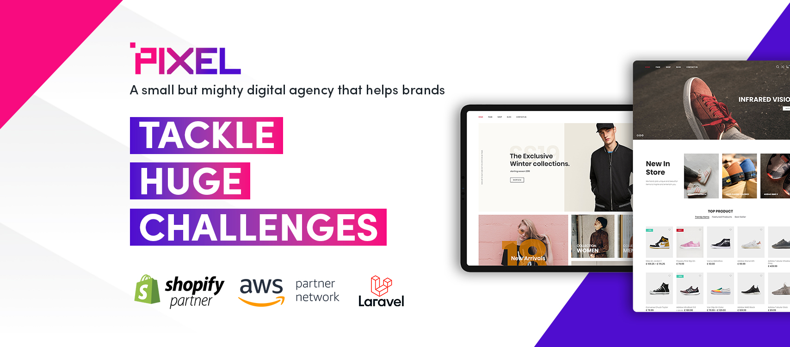

Alright, it's been a minute since I've posted anything but hear me out. It's for good reason.

I've been very busy, working extremely long, tiring, and difficult hours to get this thing off the ground.

But the day has arrived, I finished up at my role as Head of Development yesterday, and I am now Managing Director of [Pixel](https://wearepixel.com)

#### Quick social plug, make sure you follow us everywhere:

[LinkedIn](https://www.linkedin.com/company/pixeldigitalau)

[Twitter](https://twitter.com/pixeldigitalau)

[Facebook](https://www.facebook.com/pixeldigitalau)

[Instagram](https://www.instagram.com/pixeldigitalau)

I'll let you in on a secret 🤫: I've got some pretty 🔥 value-driven content coming out soon that you won't want to miss.

## Woah, say what? 😮

This has been a very long time coming. 8 and a half years to be exact. 🚀

When I started my development career 8 and a half years ago I knew instantly that one day I wanted to be the one running the show. Over the years I've worked incredibly hard to build not only my reputation in the industry but also my knowledge in all things digital and how to truly impact the websites of my clients.

Having spent time at a huge eCommerce brand - [Culture Kings](https://www.culturekings.com.au/), two stints at eCommerce agencies, and one at an agency specialising in bespoke custom solutions (think admin/management portals, debt collection platforms, etc). I'm now extremely confident in my ability to service my clients and turn their investments into great returns through my actions.

## Why an agency and not just freelance?

Lots of different reasons have prompted me to make this an agency and not just me doing some freelance on the side.

The biggest reason for this decision is my belief in team collaboration. I learnt very early on in my career that multiple minds are stronger and better than any single mind could ever be.

Luckily, I've managed to find a few really talented developers to join me on this ride, which has helped me have enough confidence in Pixel and what we can do for our clients.

## We do only what we're good at: eCommerce & Bespoke solutions 

Pixel instantly niched down. 

I refuse to let Pixel become a number in this game. Pixel is more than an agency - we are an exceptional crew of bloody smart individuals who do great things with eCommerce and can solve some pretty complex problems through custom applications. 

I don't mean that in any kind of cocky way, just extremely confident that I can help steer this team into solving some pretty complex problems 🔥

## Go hard or go home

I've poured a lot of money into getting this agency off the ground.

I spent quite a decent sum of money on the domain [wearepixel.com](https://wearepixel.com) and have even hired a full service social media agency to manage all of Pixel's social media channels.

Not only that, but I've also hired an exceptional accounting team and managed to meet a pretty cool accountant who keeps me in check. I definitely value someone making sure I'm spending the money wisely.

I've also opted, for at least the first part of this agencies life, to sacrifice some of my pay to invest that back into the agency and helping it become an amazing beast that competes with other agencies for some of the best awards that any digital agency could achieve.

## Chat to us

Well that's the exciting news that I've been waiting weeks to tell everyone. It's now time to watch this baby grow and achieve all of the big ambitious goals I have for the business.

I'll be honest here though - we're already almost fully booked for the first few months 🚀 so if you're wanting to see how myself and the team could help your business, make sure you reach out ASAP either through my [LinkedIn](https://www.linkedin.com/in/joelwmale/) or through [Pixel's website](https://wearepixel.com)

I'll make sure I share my learnings as I go.