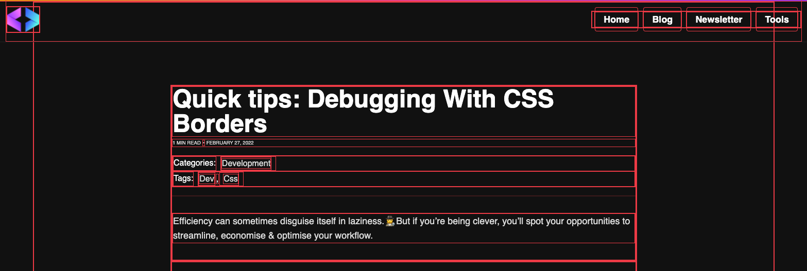
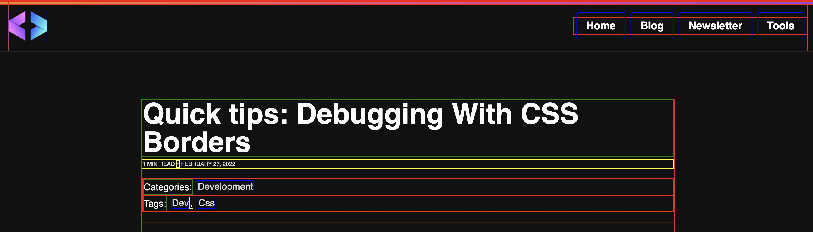

This is a topic that comes up every now and then on Twitter and a few other platforms I regularly visit.

The aged old secret of debugging CSS and layouts.

## Introducing *

`*` is a magical selector in CSS that selects all elements below it which means it has powerful effects 💪

```css
* {
    font-size: 24px;
}
```

The above CSS will set the default font-size across all elements (including header tags) to `24px`.

By adding this CSS at the top level, you can do some pretty crazy things, but keep in mind, it is not a specific selector, meaning any specific selectors like `h2` will still apply and override the properties set via `*`

## How does this help debugging?

What is the most typical issue we encounter with CSS

### Layout positioning 🤦

Yep. If I had a dollar for every time I've had positioning issues in CSS, I'd have exactly a million dollars.

I typically have these issues when dealing with absolute elements, or repeating elements with margins and paddings.

This 3 line code, also dubbed the `console.log` of CSS solves all of that:

```css
* {
    border: 1px solid red;
}
```

This very quickly highlights all elements, resulting in a look like this:



You can very quickly see where the elements are starting and ending, and their bounding boxes which makes things a little easier to debug.

How about this one:

```css
div {
  border: 1px solid red;
}

h1, h2, h3, h4, h5, h6 {
  border: 1px solid green;
}

p, span {
  border: 1px solid yellow;
}

a {
  border: 1px solid blue;
}
```

Now we see:

- Divs with red borders
- Heading tags with green borders
- P + span tags with yellow tags 
- Links with blue tags



Simple, but effective debugging with just a few lines of code 🚀