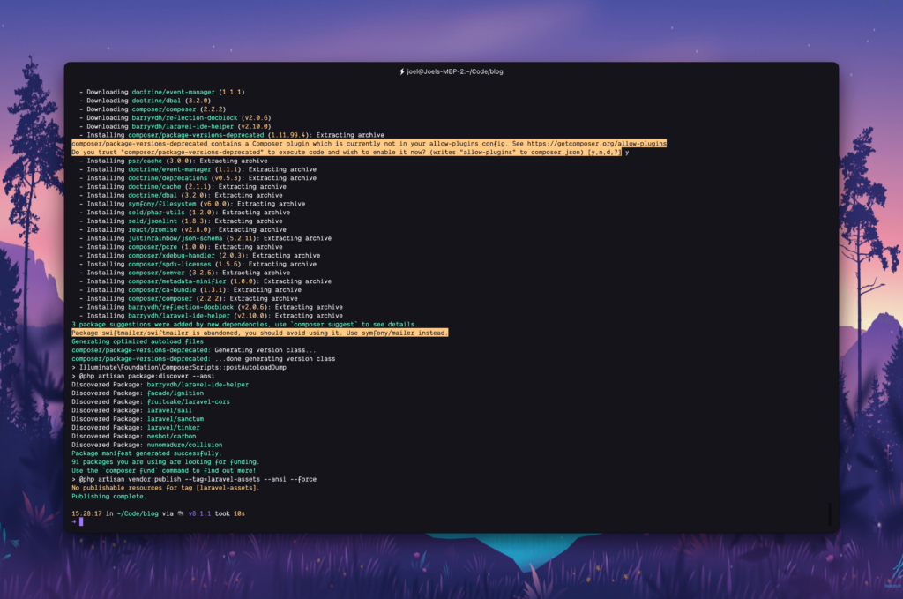

It's well known if you've been around anyone in the Laravel community that it's a bit too magical sometimes, but that's what makes it such a developer-friendly framework. Sadly, this comes at a cost as your IDE doesn't know how to magically find all that magic to provide meaningful suggestions.

For this post we're going to start with a relatively fresh copy of [Visual Studio Code](https://code.visualstudio.com/) with just a few plugins to make it look better.

This is an image of what an out of the box copy of really any IDE will show you when you're calling a Laravel model


As you can see, VSCode doesn't even know what a Post is, even though it's a model and PHP class within the project.

This already introduces a few issues as it also doesn't know that it has a bunch of magic methods attached to it due to it extending `Model`.

A simple extension will fix this and add a bunch of extra functionality to really get us all the way there to magical intellisense in our Laravel projects.

## PHP Intelephense

PHP Intelephense is an incredible extension for VSCode that with just a single install brings a world of useful productivity enhancing functionality to the IDE.

Out of the box, it has support for:

- Fast camel/underscore case code completion
- Detailed signature (parameter) help
- Workspace wide find all references
- Rapid workspace wide go to definition support
- Reads PHPStorm metadata for improved type analysis and suggestions.
    - Remember this, as we'll be utilising something else later on to enhance our suggestions ever further 🙂

Let's install it: [PHP Intelephense](https://marketplace.visualstudio.com/items?itemName=bmewburn.vscode-intelephense-client).

Now what does it look like?


As you can see, VSCode now knows of the Post model, and will provide us with some really fantastic suggestions when we use the class.

It does unfortunately still not know about a few of the magic methods that we now have access to, like relationships.

Take the following relationship on the Post model:


You'd now expect that VSCode knows about the comments function, and may even expect that it knows it's going to return many comment models, but does it?


The answer is sadly no. We still have one more step before VSCode is fully aware of all of Laravel's magic.

Let's get it done

## Laravel IDE Helper

[Laravel IDE Helper](https://github.com/barryvdh/laravel-ide-helper) is a package created by the absolutely legendary [Barry vd. Heuvel](https://github.com/barryvdh) who is also responsible for some really incredible projects like [laravel-debugbar](https://github.com/barryvdh/laravel-debugbar). It generates helper files that enable your IDE to provide accurate autocompletion. Generation is done based on the files in your project, so they are always up-to-date.

We can install it into our project with just a single composer command:

```bash
composer require --dev barryvdh/laravel-ide-helper
```

Your terminal should look something like this:



Now we'll have to run a few custom commands which are responsible for generating all of the static metadata files so that intelephense can read and provide very smart suggestions on:

```bash
php artisan ide-helper:generate // PHPDoc generation for Laravel Facades
php artisan ide-helper:models // PHPDocs for models
php artisan ide-helper:meta // PhpStorm Meta file
```

If all 3 of them ran successfully, you should have the following files in the root of your project

- `_ide_helper_models.php`
- `_ide_helper.php`
- `.phpstorm.meta.php`


We don't need these files to live in any kind of source control as we'll make sure they're generated fresh every time someone runs `composer install`. This will solve any potential conflict issues before they arise! We can ensure these files are not added to git by adding them to our `.gitignore`:

```bash:title=.gitignore
/node_modules
/public/hot
/public/storage
/storage/*.key
/vendor
.env
.env.backup
.phpunit.result.cache
docker-compose.override.yml
Homestead.json
Homestead.yaml
npm-debug.log
yarn-error.log
/.idea
/.vscode

_ide_helper_models.php
_ide_helper.php
.phpstorm.meta.php
```

So now, with any luck, intelephense should be a lot smarter and suggest some of the magic to us!


Beautiful! VSCode now knows of the `comments()` relationship, know's that it returns `many comments` and has even read our little docblock annotation so we can read it whenever we're calling the function for the relationship.

How about something a little more advanced like can it read a service class?

Take this simple `SearchService` as our example:


But does VSCode now know about this function?


It does 🔥

We've now just super charged VSCode to know almost all of Laravel's magic.

## Generating the meta files when composer runs

So now that we've confirmed it all works, and we added these files to `.gitignore`, let's now tell composer to run those 3 commands every time someone runs `composer install`, `composer require <package>`, `composer remove <package>` or `composer update`

Let's add the following to our `composer.json` file:

```json:title=composer.json
        "post-install-cmd": [
            "@php artisan ide-helper:generate",
            "@php artisan ide-helper:meta",
            "@php artisan ide-helper:models --nowrite"
        ],
        "post-update-cmd": [
            "@php artisan vendor:publish --tag=laravel-assets --ansi --force",
            "@php artisan ide-helper:generate",
            "@php artisan ide-helper:meta",
            "@php artisan ide-helper:models --nowrite"
        ],
```

So now your file should look like this:


Let's verify that it now works by simply running `composer install`:


If your output has the above 3 highlighted lines, then we can call this a massive success 🔥

Now whenever you install or update your composer packages, the helper files are automatically re-generated, which means you're constantly getting the best suggestions you could be getting.

As an added bonus, your colleagues will automatically get these helpers as well and their IDEs will pick up on them to make their development experience better as well, that is definitely 🔥

Feel free to reach out to me on Twitter @ [joelwmale](https://twitter.com/joelwmale) if you have any issues or follow me to see more tips like this one!