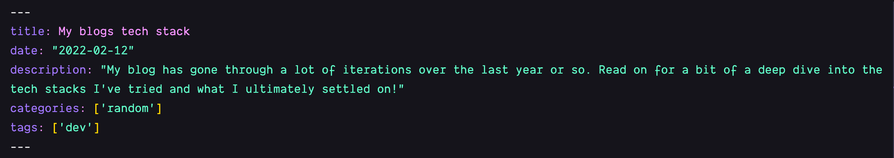

Like most developers, my portfolio has always been one of the most annoying projects I've ever worked on. Why? Well, it's because I have the opportunity to just be so particular.

Like all of the other projects I've worked on - it's always led by the client or a design that's already been completed, so I'm locked into how it looks and how it works. But with my projects and most specifically my ever-changing blog, it's always completely dictated by me.

## How did I settle on how I wanted it to look?

Well truth be told, I haven't.

With every blog post, I change some element about the website. Sometimes it's a small change like the size of a header or the shade of the colour, but sometimes it's a massive change like overhauling the entire blog post template 🤦.

I'm not sure how I'm ever going to get over this weird passion I have for this blog, but if anyone has any tips, do let me know on [Twitter](https://twitter.com/joelwmale), beautiful plug I know, thanks

## The tech stack evolution

As a developer, you never want to settle for a tool like WordPress as your initial thought is that it's too restrictive.

Your first thought is to always code something that is free, and that you have full control over. Whilst this is always your first thought, and you may ultimately drop a few hours into setting up and starting such a project, it's never the first version of your website, and the same went for me.

### Laravel

I ultimately started this blog in PHP and a framework called [Laravel](https://laravel.com/) as it's been my bread & butter my whole career. This ended up being a horrible idea as I just tried to re-invent the wheel of blog posts, categories, tags, etc.

I can confidently say I wasted a good few hours or even a day here 😅 

### WordPress

This is probably the platform you all think my blog is running right now as it was for about a year or so, but head over to [/admin](/admin) or [/wp-admin](/wp-admin) and find out for yourself.

I used to share the same disgusting thoughts about WordPress as a majority of the dev community does - that it's just over-bloated and ugly to work with. 

It could not be further from the truth though.

WordPress isn't *horrible* to work with if you work with some of the best page builders, like [Oxygen Builder](https://oxygenbuilder.com/) and [Elementor](https://elementor.com/), but I'd be lying if I said I enjoyed working with the WordPress framework under the hood.

My biggest gripe with WordPress + page builders like Oxygen, is that **it's so slow**. Designing the pages is incredibly inefficient as there are 6 button clicks just to get to the screen where you adjust padding and margin, and don't even get me started on how slow the page builder interface becomes when you have more than 50-60 divs on your screen.

The developer inside of me just can't help but get frustrated at how slow the whole process is... 

Since discovering [TailwindCSS](https://tailwindcss.com/) I just haven't been able to code the same.

### The current & *hopefully* forever stack: Gatsby

It's technologies & tools like this and [Laravel Livewire](https://laravel-livewire.com/) where I can't help but kick myself. Why didn't I use these tools when I first saw them?

I originally heard about Gatsby a few years ago, but I just didn't pay too much attention to it, but god damn was I naive.

Being able to live within VSCode, write in markdown, and have Gatsby convert that (using a markdown parser) into a full-fledged blog post, with the ability to define any type of data I need at the top of each post?

Absolutely 🔥 

What's most likely happened though, is that I did see and look into Gatsby when I first heard about it but back then it was a much more immature framework and didn't currently have the community support that it now does in terms of plugins, guides, and tutorials.

Hands down though - without a doubt, if you even remotely want full unrestricted access to your blog, but don't want to deal with reinventing the wheel, then Gatsby is the way to go 🚀 

### Never stop iterating

I just want to quickly tack this onto the end as it's a constant fight that I have with this website. With every new blog post, I discover more issues or more dislikes I have with my website, and that's both great and bad.

Great because it means I'm constantly iterating, and constantly making it **better**
Bad because it makes my posts take triple the amount of time 😄 

Don't just settle with your blog/website as you'll just look at it and not like what you see, but do try and meet find middle ground, where you're happy enough with what you see, and can iterate and improve next time around.

Until next time folks, follow me on [Twitter](https://twitter.com/joelwmale) for some more 🚀 🔥 dev tips.