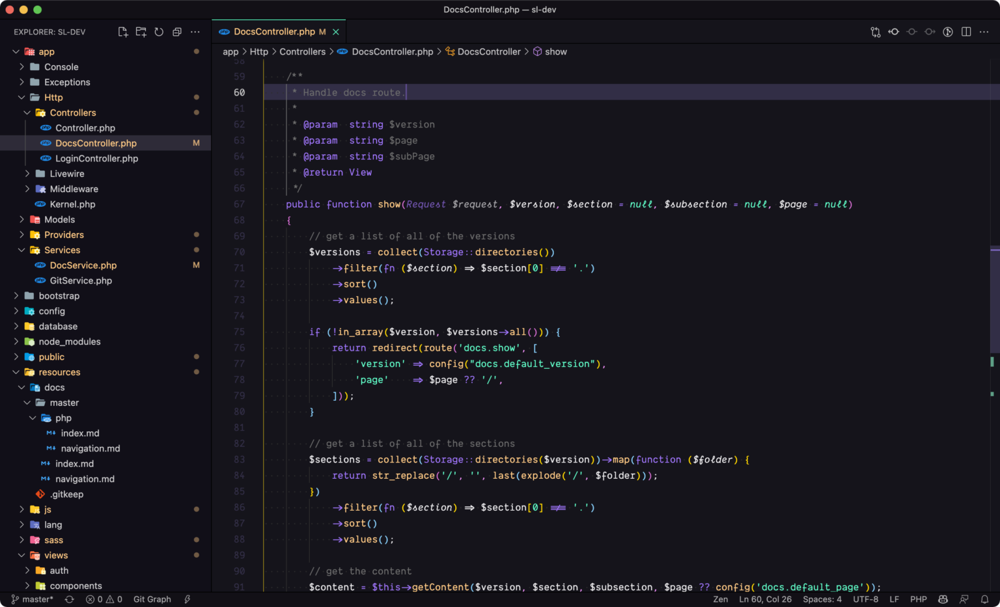
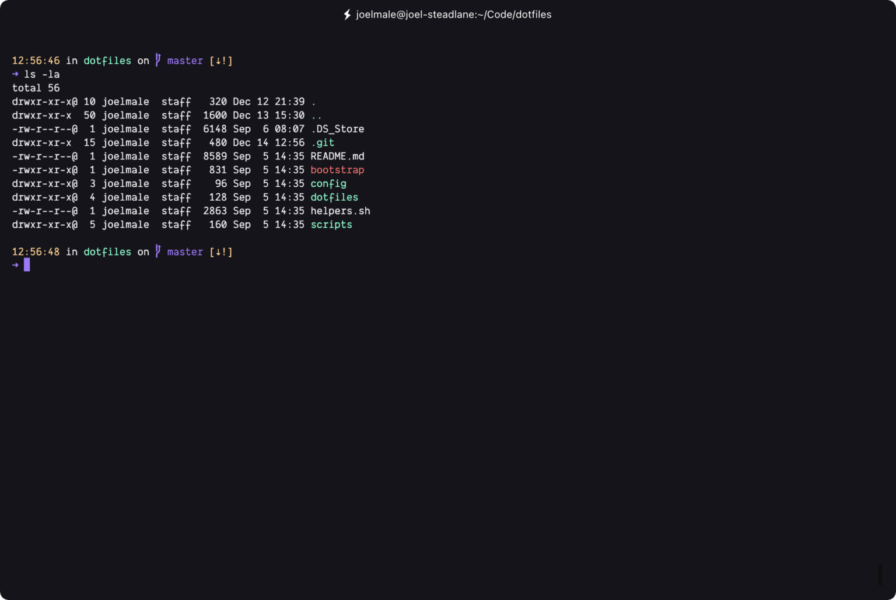
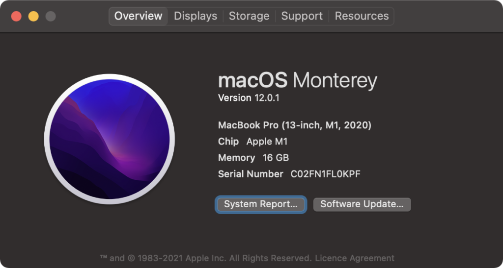
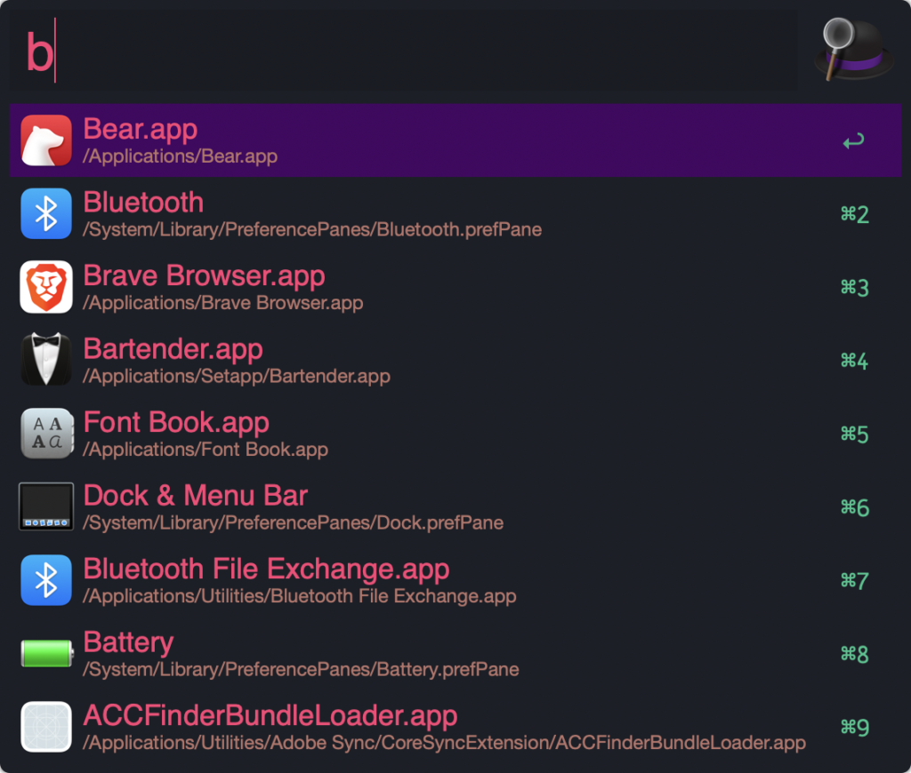

I spend more time than I honestly should looking at ways to better my dev setup and be more productive in my day to day.

At some point, I know I'll hit the point of diminishing returns where the time spent trying to be more productive, is no longer yielding the results that make it worth it but for now, I love reading posts from other developers.  

## Personal Dotfiles

If you've heard about the concept known as dotfiles then you know exactly where I'm headed with this.

But, if you're blissfully unaware of what it is, then let me educate you and show you the true power.

This is the link to my [personal dotfiles](https://github.com/joelwmale/dotfiles). In their raw form, they are simply any files that start with a `.`, but when paired together with files responsible for bootstrapping an environment - they make an extremely strong couple.

## Defaults

My [defaults script](https://github.com/joelwmale/dotfiles/blob/master/scripts/defaults.sh) within my dotfiles repository is responsible for configuring MacOS the way I like it. It does things as simple as:

```bash
running 'Show battery percentage'
defaults write com.apple.menuextra.battery ShowPercent YES
```

To more advanced things like configuring the app store:

```bash
running 'Enable the automatic update check'
defaults write com.apple.SoftwareUpdate AutomaticCheckEnabled -bool true;ok

running 'Check for software updates daily, not just once per week'
defaults write com.apple.SoftwareUpdate ScheduleFrequency -int 1;ok

running 'Download newly available updates in background'
defaults write com.apple.SoftwareUpdate AutomaticDownload -int 1;ok

running 'Install System data files & security updates'
defaults write com.apple.SoftwareUpdate CriticalUpdateInstall -int 1;ok

running 'Enable developer mode for mac app store'
defaults write com.apple.appstore WebKitDeveloperExtras -bool true;ok
```

This kind of script is extremely powerful as it saves an incredible amount of time configuring a MacBook the way you like it. Clicking around the numerous interfaces to update these settings individually is quite a time-consuming task and you'll likely forget to update a setting, or not even know where it is, especially if you haven't had to look at it in over a year.

## Dock

A few months ago I added a new primary script called [dock.sh](https://github.com/joelwmale/dotfiles/blob/master/scripts/dock.sh) where I'm utilising a mac app called `dockutil` to allow me to configure the dock through terminal commands.

```bash
#!/bin/sh

dockutil --no-restart --remove all
dockutil --no-restart --add "/Applications/Forklift.app"
dockutil --no-restart --add "/Applications/Brave Browser.app"
dockutil --no-restart --add "/Applications/Fantastical.app"
dockutil --no-restart --add "/Applications/Spark.app"

killall Dock
```

I like to keep my dock very clean and simple and only have my most used apps be pinned to the dock.

## Installing all the apps

This is without a doubt the most important script that I have in this list. My [install.sh script](https://github.com/joelwmale/dotfiles/blob/master/scripts/install.sh) is responsible for installing all of the applications I use on a day to day basis.

There are a few sections within this file which I've split up to allow for better management.

### Directories & Configs

This section symlinks all of my `actual dotfiles` to their expected locations so that whenever I make updates to a dotfile on another laptop, I simply pull down this repository and due to the symlink, my system also updates. That's the power of dotfiles + symlinks!

### Default cleanup

No one uses garage band, imovie, keynote, or podcasts, as the apple solutions are not as good as other vendors solutions to these problems, so get rid of them.

### Brew

This is the most important section for me as it installs all of the packages I use daily. I've taken a snapshot of the list and pasted it below.

```bash
require_brew git
require_brew gh
require_brew node
require_brew pkg-config
require_brew wget
require_brew httpie
require_brew ncdu
require_brew hub
require_brew ack
require_brew bat
require_brew doctl
require_brew yarn
require_brew diff-so-fancy
require_brew zsh-autosuggestions
require_brew awscli
require_brew tree
require_brew mas
require_brew dockutil
```

`require_brew` is simply a function that calls `brew install`

```bash
function require_brew() {
    brew list $1 > /dev/null 2>&1 | true
    if [[ ${PIPESTATUS[0]} != 0 ]]; then
        action "brew install $1 $2"
        brew install $1 $2 > /dev/null 2>&1
        if [[ $? != 0 ]]; then
            error "failed to install $1! skipping..."
        else
            ok
        fi
    fi
}
```

The casks "subsection" is the section where I install all of my apps, using casks within brew:

```bash
require_cask google-chrome
require_cask firefox-developer-edition
require_cask brave-browser
require_cask visual-studio-code
require_cask fork
require_cask transmit
require_cask tableplus
require_cask hyper
require_cask spotify
require_cask 1password
require_cask insomnia
require_cask alfred
require_cask spectacle
require_cask bartender
require_cask docker
require_cask forklift
require_cask fantastical
require_cask google-backup-and-sync
require_cask dropbox
require_cask slack
require_cask the-unarchiver
require_cask appcleaner
```

Again, `require_cask` is just a function that runs `brew install --cask`

```bash
function require_cask() {
    brew cask list $1 > /dev/null 2>&1 | true
    if [[ ${PIPESTATUS[0]} != 0 ]]; then
        action "brew install --cask $1 $2"
        brew install --cask $1 > /dev/null 2>&1
        if [[ $? != 0 ]]; then
            error "failed to install $1! skipping..."
        else
            ok
        fi
    fi
}
```

### Everything else

The rest of the script installs and configures npm, composer, and the associated packages I use. There is also a section at the bottom which sets up my shell/terminal by installing a few very useful packages.

## IDE / Code Editor



I have spent a lot of time configuring my IDE, but I'll try to break it down.

I recently swapped from using my [Horizon theme](https://marketplace.visualstudio.com/items?itemName=joelwmale.vscode-horizon-theme) to using the beautiful [Aura theme](https://github.com/daltonmenezes/aura-theme/). I use the [Dank Mono](https://philpl.gumroad.com/l/dank-mono) font.

As you can tell from the screen, I've hidden quite a lot from the default view of vscode:

- Minimap
- Open editors
- The context menu on the left

You can get a full breakdown of my vscode settings [here.](https://gist.github.com/joelwmale/2e28670fd88cb9a1b8db9ea93cfc0e2b#file-settings-json)

I currently mostly do Shopify + Laravel development with TailwindCSS for the front-end, so a lot of my extensions revolve around making that process as efficient as possible.

Some of my favourite plugins are:

- [Atom keymap](https://marketplace.visualstudio.com/items?itemName=ms-vscode.atom-keybindings)
- [GitLens](https://marketplace.visualstudio.com/items?itemName=eamodio.gitlens)
- [Import Cost](https://marketplace.visualstudio.com/items?itemName=wix.vscode-import-cost)
- [Laravel Blade Spacer](https://marketplace.visualstudio.com/items?itemName=austenc.laravel-blade-spacer)
- [Laravel Extra Intellisense](https://marketplace.visualstudio.com/items?itemName=amiralizadeh9480.laravel-extra-intellisense)
- [Laravel Traveller](https://marketplace.visualstudio.com/items?itemName=freshbitsweb.laravel-traveller)
- [PHP Intelephense](https://marketplace.visualstudio.com/items?itemName=bmewburn.vscode-intelephense-client)
- [Simple New File](https://marketplace.visualstudio.com/items?itemName=fayras.simple-new-file)
- [Tailwind CSS IntelliSense](https://marketplace.visualstudio.com/items?itemName=bradlc.vscode-tailwindcss)

## Terminal

This is what my terminal currently looks like:



I use [Hyper.is](https://hyper.is/) for my terminal and have for a very long time.

It is an electron based terminal, which allows for complete use of the keyboard and skipping through words, selecting words at a time, pasting with shortcuts, etc.

I do not have too many plugins for Hyper as honestly it is great just out of the box.

The most notable ones are simply:

- [Aura theme](https://github.com/daltonmenezes/aura-theme)
- [Spaceship prompt](https://github.com/spaceship-prompt/spaceship-prompt) - this is what is showing the repository and current branch on my terminal.

I use both [Z shell](https://en.wikipedia.org/wiki/Z_shell) and [Oh My Zsh](https://ohmyz.sh/) for my bash terminal, and my `.hyper.js` config file is available on my [dotfiles repository.](https://github.com/joelwmale/dotfiles/blob/master/dotfiles/vendor/.hyper.js)

## Bash Aliases

I have quite a few bash aliases, which can all be found [here](https://github.com/joelwmale/dotfiles/blob/master/dotfiles/shell/.bash_profile), but for a quick summary of some of my most used/favourite:

```bash
vs () { VSCODE_CWD="$PWD" open -n -b "com.microsoft.VSCode" --args $* ;}

alias code="cd ~/Code"
alias dotfiles="cd ~/Code/dotfiles"
alias q="cd ~ && clear"

alias pa="php artisan" 
alias dbfresh="pa migrate:fresh --seed"

alias twatch="TAILWIND_MODE=watch npx mix watch" 

alias gcp="git checkout -"
alias gmp="git merge -"
```

## Local Dev

I use quite a few apps and packages to make my dev workflows more productive.

### MacOS



I'm an avid MacOS user for development, and typically like to stay current, so I am almost always running the latest version. I have previously dared to use beta versions of MacOS, but have been stung with that a few times with support for some of the tools I use, so I now just wait for the full release.

You can see a full breakdown of how I choose to customise my MacOS settings [here](https://raw.githubusercontent.com/joelwmale/dotfiles/master/scripts/defaults.sh) in my dotfiles repository.

### Laravel Valet

For running all of my PHP code locally I use [Laravel Valet](https://laravel.com/docs/8.x/valet) as it just makes it incredibly easy.

It has some very powerful features like being able to `park` your projects directory which lets you access all of the projects within it by simply typing the folder name + the tld, so for example if you have a folder called `my-app` then it would be accessible at `http://my-app.test` without having to configure PHP, Nginx, or any other kind of service to load the folder.

### Databases - TablePlus

I've used a lot of database clients in my time and was guilty of not sticking to a client, but since finding [TablePlus](https://tableplus.com/) I have not changed. Beautiful UI with great support for all of the most common databases, with an added bonus of shortcuts to easily change databases, tables, search, etc.

### Communication

I use [Slack](https://slack.com/intl/en-au/) for work and [Discord](https://discord.com/) + [Telegram](https://telegram.org/) for dev-related communications.

### Alfred

[Alfred](https://www.alfredapp.com/) is single handedly the most powerful tool I use daily. I simply could not mac without it.

I can bring up Alfred at any point by pressing `CMD + E` which brings up the search and browse ui, which let's me search and launch applications, find files on my mac, and execute custom workflows all by typing keywords.

I use the pro version so I can use the powerpack which unlocks workflows to extend and automate a lot of my common tasks.

If you are not wanting to fork out the money for the powerpack, [Raycast](https://www.raycast.com/) is a very promising competitor, recently securing Series A funding of $15m.



### API Testing

Gone are the days of Postman, and in are the days of [Insomnia.](https://insomnia.rest/)

The features listed on their home page will tell you why this tool is so much better than Postman. It even supports custom themes, so I of course also use the Aura theme for Insomnia.

### Notable mentions

- I sometimes use [Fork](https://git-fork.com/) if I need to use a GUI for managing git repositories
- To connect to S3 and sftp servers I use [Transmit](https://panic.com/transmit/).

## General Apps

### Browser - Brave + Firefox Developer Edition

I primarily use the same laptop for both work and personal, which makes things a bit interesting. Being able to quickly change browsers and be logged into the same services with 2 different accounts at the same time makes one feel very efficient.

Brave is used for work, it is usually always logged into work related accounts and usually the tabs are all work related

Firefox dev edition (because what else?) is always for personal. Logged into personal accounts, personal tabs, etc.

Both use the [Aura theme](https://chrome.google.com/webstore/detail/aura-theme/ddipnaombfnagpagnpdkdinoekfhfjoh) I mentioned earlier.

### Password Management - 1Password

Hands down, the best password manager I've ever seen is [1Password](https://1password.com/). It has incredible out of the box support on MacOS + iOS as well as great 2FA support with being able to directly store your 2 factor password within 1Password.

This makes 2factor so easy, that you'd be incredibly silly to not add to every service which supports it.

### Emails

[Spark](https://sparkmailapp.com/) is the best client I've found so far. The feature I use most is the `pinned` emails feature. I believe behind the scenes it's just marking emails as `important` but within the Spark UI, it groups all my pinned emails together which works perfectly.

One of my biggest pet peeves is the little notification badge on my home screen, so whenever Spark shows that I have a new email, I'll always check it, and if it's important and I just don't have the time to reply or action that email now - I'll pin it and deal with it later, and once done, unpin it.

An absolute 10/10 feature that I cannot live without.

### To Dos

Where would I be without [Things](https://culturedcode.com/things/). This app unfortunately has no free version, but the paid version is so worth it.

With quick adds, a beautiful UI, easily adding notes, and even markdown support, I try my best to utilise Things as much as I can.

### Notes

I'm a developer and I appreciate being able to write markdown. So the $2 per month for [Bear](https://bear.app/) is a no brainer.

Bear beats apples notes in every way:

- Beautiful UI
- Amazing search
- Tagging
- Full markdown support
- Cross linking notes